# Test 4 - Microservicio Infraestructure: Frontend / Backend

----
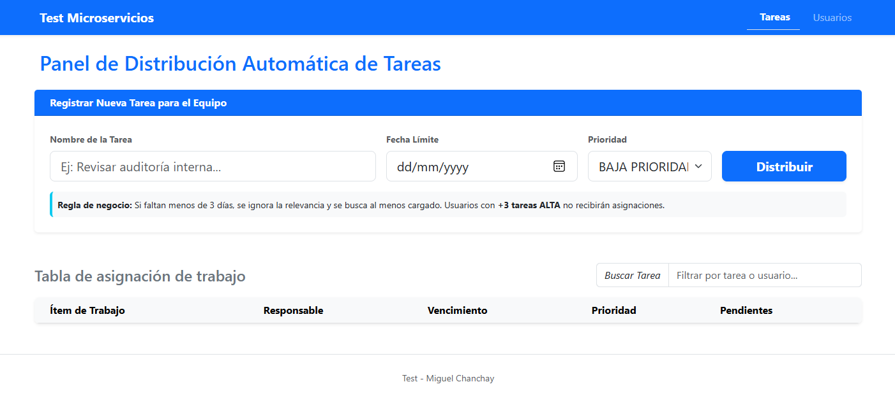
----

## Tecnologías Utilizadas

* **Frontend:** Angular 21+ (Node 22)
* **Backend:** .NET 9 Framework
* **Base de Datos:** Postgres 15
* **Gestión de BD:** PgAdmin con soporte para Docker
* **Orquestación:** Docker Compose
---

Proyectos similares:

https://github.com/ANDERSOUNDZ/test_3_cli (Angular / .Net 9 )
https://github.com/ANDERSOUNDZ/DOCKER_TEST1/ ( Angular / Spring boot JAVA)

---

## Arquitectura de Contenedores
---
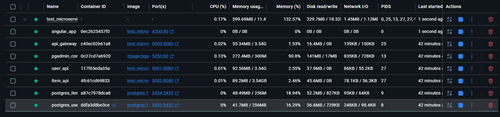

---
Applicacion de gestion de tareas automatizadas
---

Frontend - Tienda con estilo Bootstrap sencillo
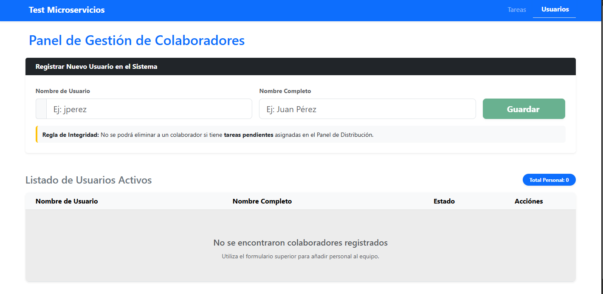

---
Backend / Hexagonal Architecture / Microservicios
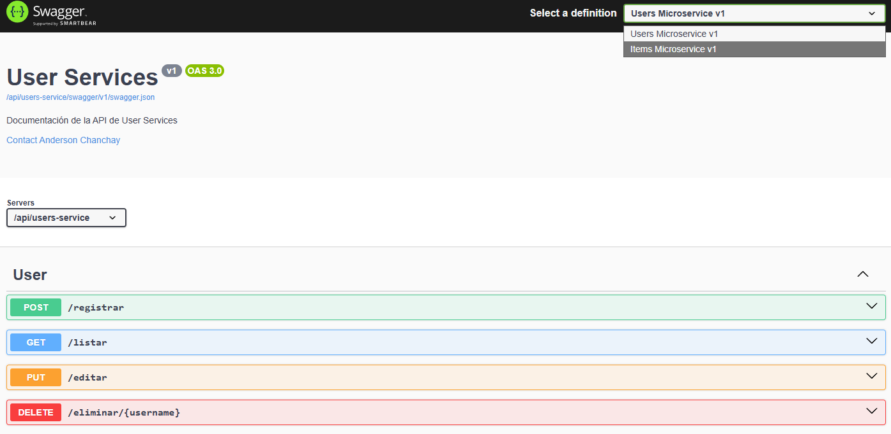
---

## Instrucciones de Ejecución

Ingresar a CMD / Powershell / terminal linux / bash :

1. Clona el proyecto
Ejecuta esta linea: git clone https://github.com/ANDERSOUNDZ/test_microservice.git

2. Entra a la carpeta
cd test_microservice

Aviso: El docker-compose ya se encuentra configurado y genera todo el ecosistema adecuado automatizado, pero si no es el caso, sigue las instrucciónes de migración:
- 1. Entra a la carpeta de cada proyecto microservices/item_infrastructure o microservices/user_infrastructure

- 2. Ejecuta los comandos de migración para cada carpeta correspondiente:

    ITEM INFRASTRUCTURE:
        dotnet ef migrations add InitialCreate --project item_service.data --startup-project item_service.webapi --output-dir migration
        dotnet ef database update --project item_service.data --startup-project item_service.webapi

    USER INFRASTRUCTURE:
        dotnet ef migrations add InitialCreate --project user_service.data --startup-project user_service.webapi --output-dir migration
        dotnet ef database update --project user_service.data --startup-project user_service.webapi

    *Esto es solamente si no genero las tablas para cada proyecto, así generamos la migración, pero solo es por casos emergentes
 ---

3. Levanta los servicios
    Ejecuta el comando completo para construir las imágenes y levantar los contenedores en segundo plano:
    Ejecutar esta linea para el orquestador:

    docker-compose up --build

(Se construyen y despliegan las bases de datos, los servicios backend y el frontend ya automatizados, adjuntado dos archivos bash para desplegar migraciónes y levantar servicios.)
---

Servicios desplegados

Una vez que Docker termine el proceso, podrás acceder a los siguientes servicios:

| Servicio      | URL / Acceso                                      | Puerto | Descripción                       |
|---------------|---------------------------------------------------|--------|-----------------------------------|
| Frontend      | http://localhost:4200/                            | 4200   | Interfaz de Usuario (Angular)     |
| Backend GATEWAY Swagger| http://localhost:5000/swagger/index.html       | 5000 / 5001 / 5002   | API                               |
| PgAdmin      | Postgres SQL Manager                            | ----   | Panel de Gestión de Base de datos visual            |
| Databases Postgres      | localhost,5434:5432 / 5433:5432                                    | 5434 / 5433   | Postgres SQL 15                  |

----
Configuración de PgAdmin Management SQL ( Visualizar Base de datos )
---
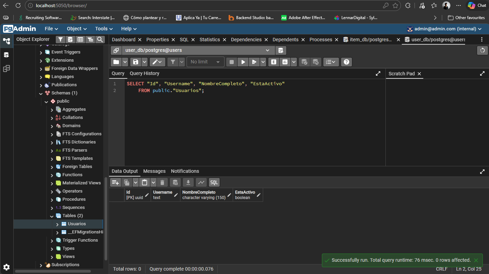

Una vez que observes en la consola que los servicios están "Healthy":
Abre PgAdmin en la ruta asignada: http://localhost:5050/browser/

Registra las bases de datos: tal cual como esta tipado:
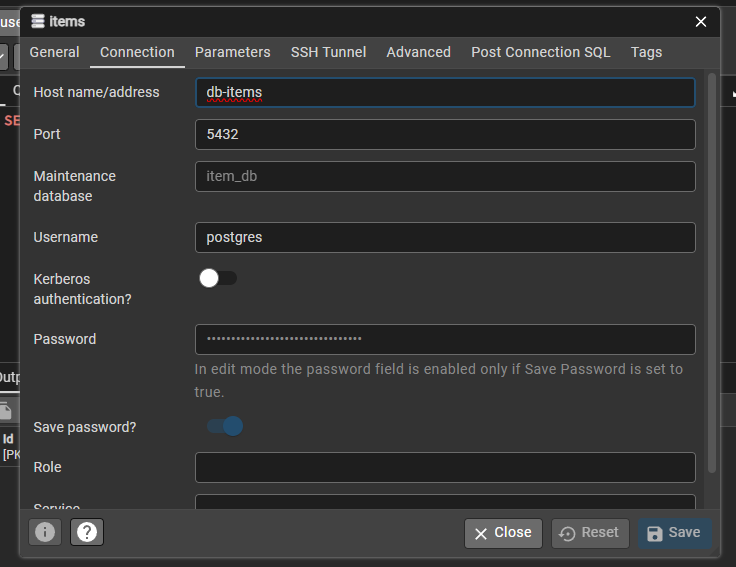 | 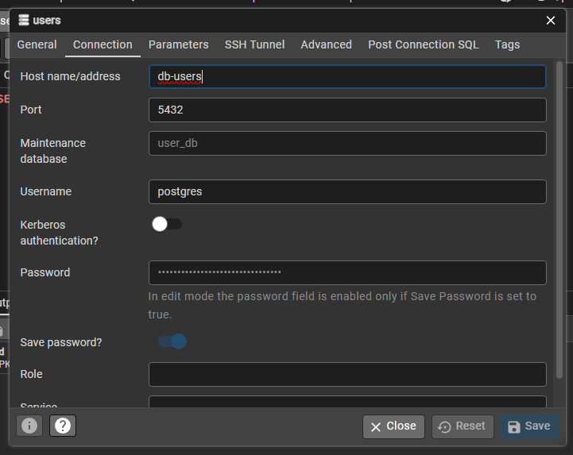

Conexión 1 (usuarios):

Name: Microservicio Usuarios
Host name/address: db-users
Port: 5433
Maintenance database: user_db
Username: postgres
Password: root123*

Conexión 2 (Items / Tareas / Tickets):

Name: Microservicio Items
Host name/address: db-items
Port: 5434
Maintenance database: item_db
Username: postgres
Password: root123*

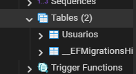 | 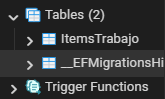

----

Applicacion de gestion de tareas automatizadas
Frontend - Backend
---
Manejo de rama - Una sola anexado en el documento
---
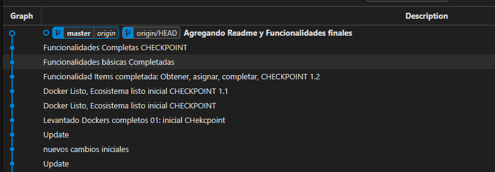

Funcionalidades Frontend:
---

1. Mensaje: "Todos los usuarios están saturados" (Microservicio independiente: Item)
Este mensaje ocurre cuando la regla de saturación bloquea a todo el equipo. 
Usuario A: Tiene 3 tareas de prioridad ALTA pendientes.
Usuario B: Tiene 3 tareas de prioridad ALTA pendientes.
Acción: Intentas registrar una nueva tarea (no importa si es de prioridad Alta o Baja)
Resultado: El sistema filtra a todos los usuarios porque todos tienen TotalAltaRelevancia >= 3.
Al quedar la lista vacía, lanza la excepción.

2. Mensaje: "Tarea asignada exitosamente: [NombreUsuario]" (Microservicio independiente: Item)
(Caso Urgente)Aquí validamos que la fecha manda sobre la relevancia.
Usuario A: Tiene 5 tareas pendientes (todas de baja prioridad).
Usuario B: Tiene 1 tarea pendiente (baja prioridad).
Evento: Creas una tarea con Fecha de Entrega para mañana (menos de 3 días).
Resultado: Aunque el Usuario A esté más desocupado de "alta relevancia",
el sistema elegirá al Usuario B porque es urgente y él tiene el menor número total de pendientes ($1 < 5$).

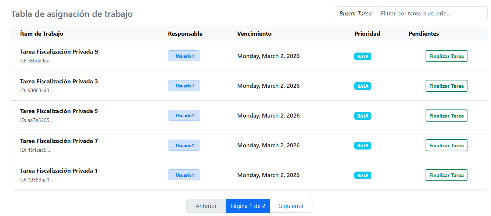
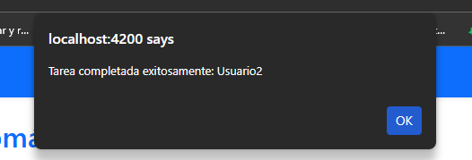

3. Mensaje: "Tarea asignada exitosamente: [NombreUsuario]" (Microservicio independiente: Item)
Aquí validamos que los ítems relevantes buscan al menos cargado.
Usuario A: Tiene 2 tareas de Alta Relevancia.
Usuario B: Tiene 0 tareas de Alta Relevancia.
Evento: Creas una tarea de Alta Prioridad con fecha para dentro de 15 días.
Resultado: El sistema asignará al Usuario B.
El sistema prefiere no estár saturado y tiene "más espacio" para dar tareas críticas antes de llegar al límite de 3.

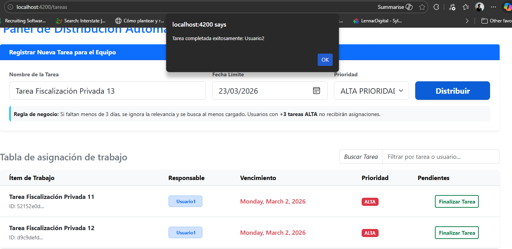
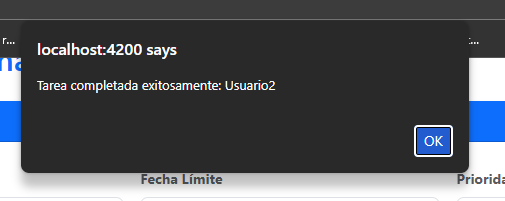

4. Visualización: Cambio de "Finalizar" a "Terminado"Este es el flujo para validar tu monitor de carga. (Microservicio independiente: User)
Evento: 1.  Ubicas una tarea en la tabla (ej. "Revisar Servidores").
2 Haces clic en el botón verde Finalizar.
3 Aceptas el confirm de el pop up,
Resultado: la fila cambia de finalizar tarea a Terminado refieriendose a que termino la tarea.

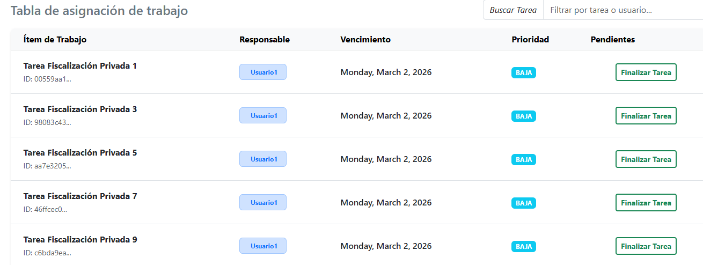
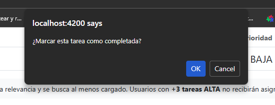
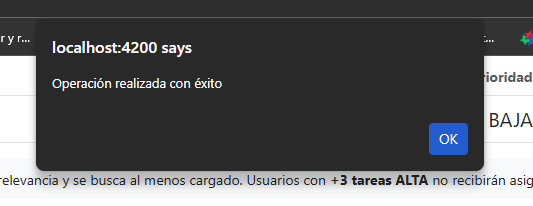
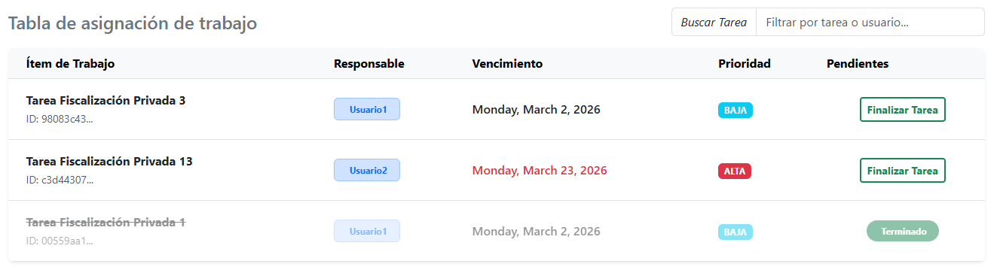

5. Eventos adicionales:
Validaciones:
- 1. Validacion de campo para el ingreso de tarea a algun usuario
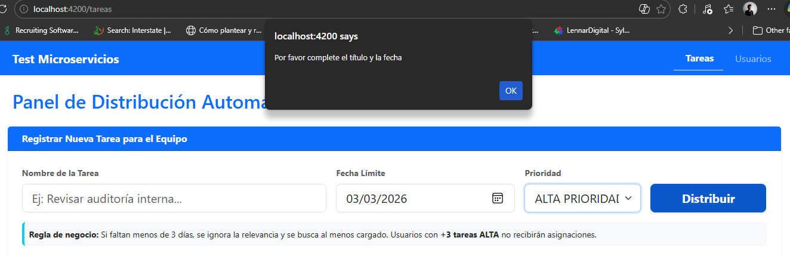

- 2. Validacion para no eliminar a un usuario si tiene tareas asignadas (Microservicio independiente: User)
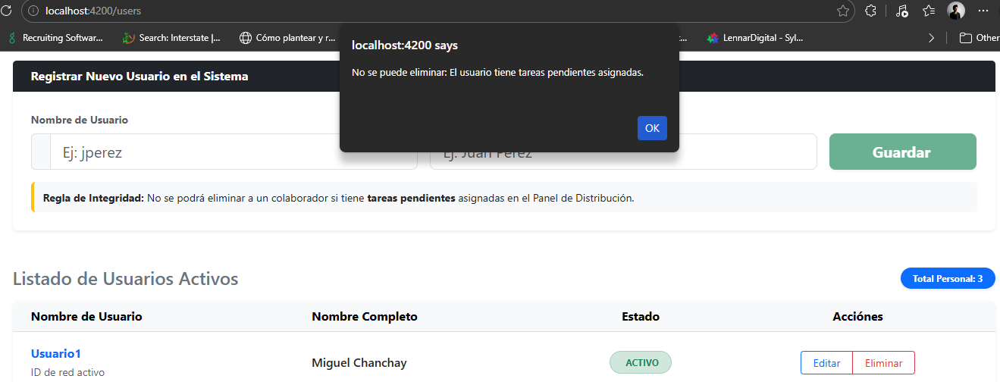

- 3. Creación de usuario

---
Funcionalidades Backend

- Arquitectura hexagonal, Puertos, Adaptadores, Use Case, Repositories, Fluent Validation, SOLID, Partial Clases, Injection dependency.
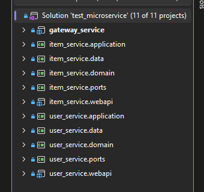

- Busca desde el servicio de items a usuarios via HTTP
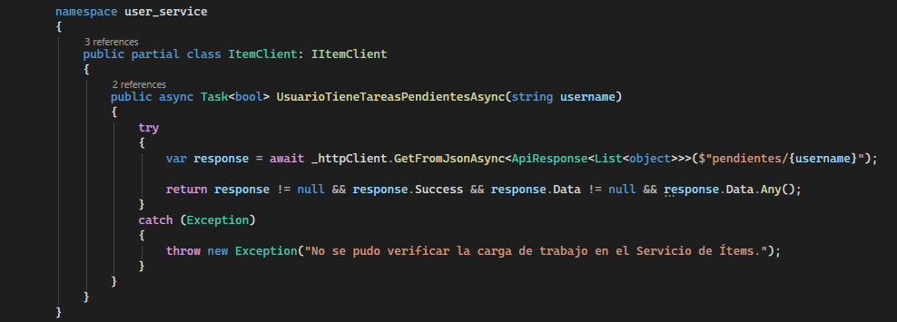
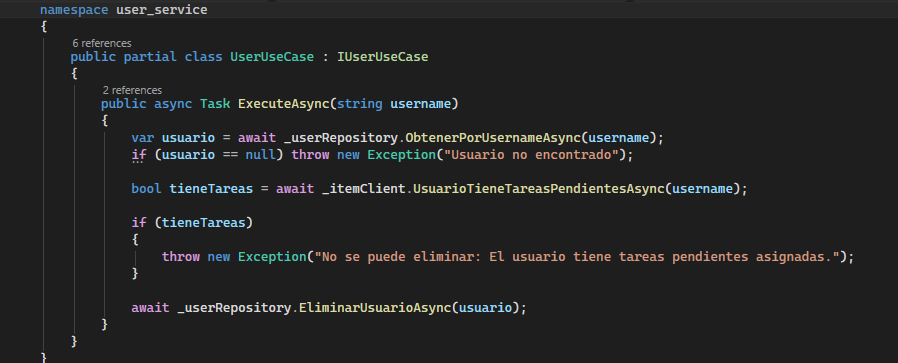
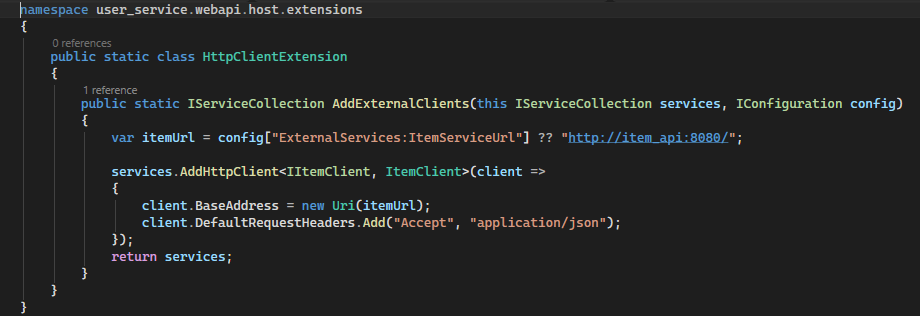

- Busca que no elimine a un usuario que tiene tareas desde el servicio de user al item via HTTP
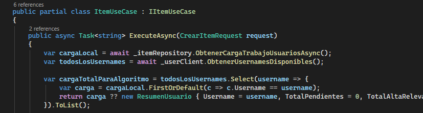
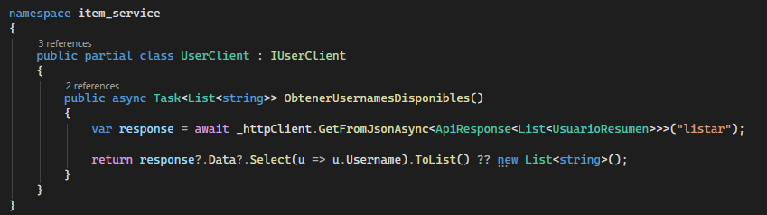
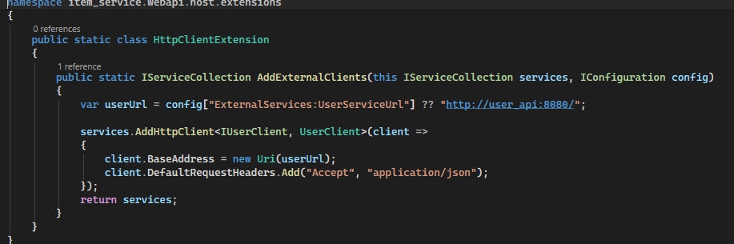

1. Tabla User
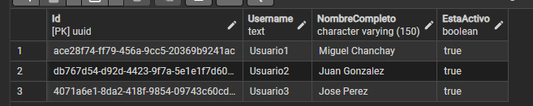

2. Tabla Item
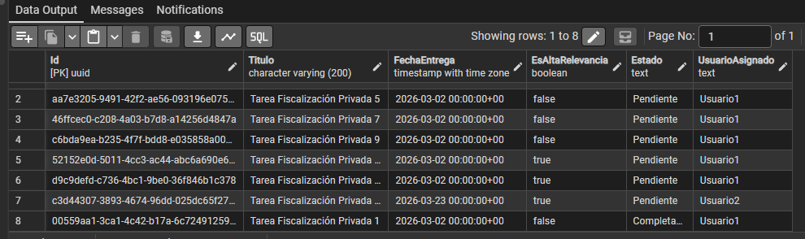

- Busca que no elimine a un usuario que tiene tareas desde el servicio de user al item via HTTP
Validaciones desde el Backend
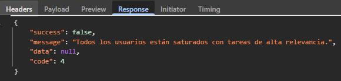

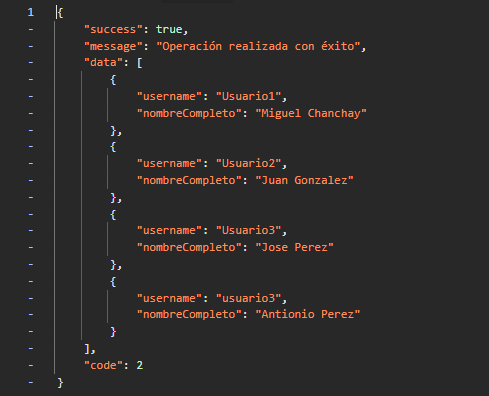

Orquestador Docker Estable
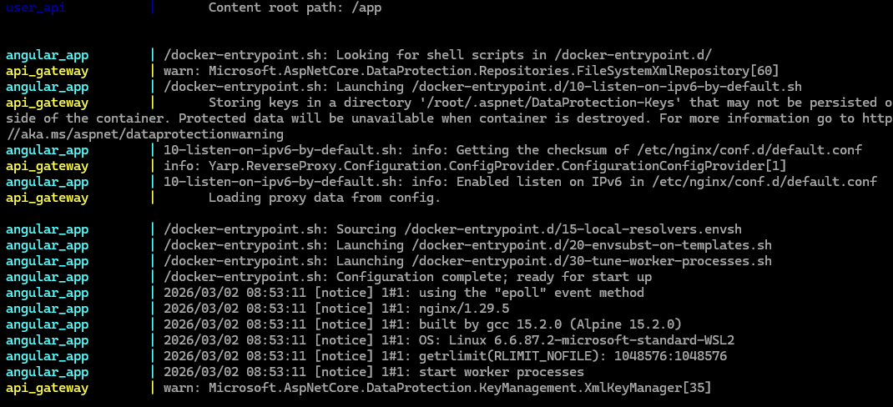

Servicios levantados: 
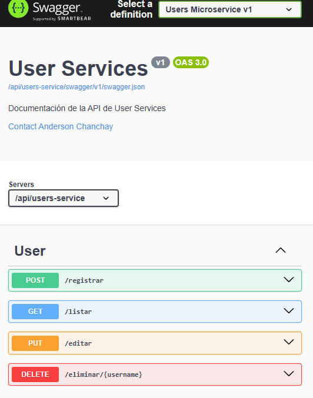
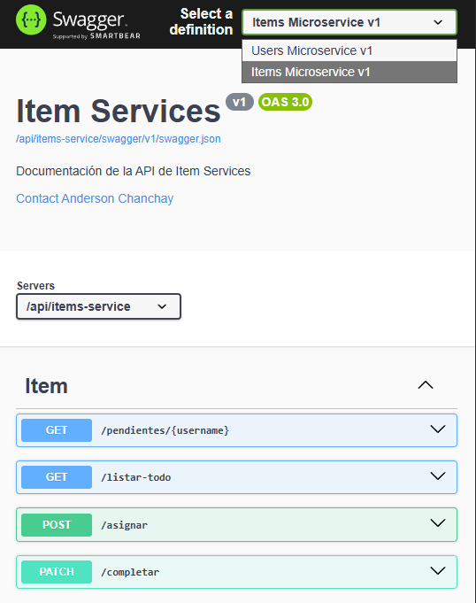

Miguel Chanchay.